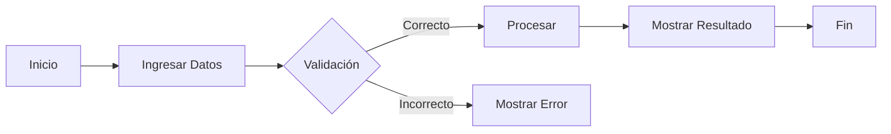

<!--
██████╗ ██████╗  ██████╗      ██╗███████╗ ██████╗████████╗
██╔══██╗██╔══██╗██╔═══██╗     ██║██╔════╝██╔════╝╚══██╔══╝
██████╔╝██████╔╝██║   ██║     ██║█████╗  ██║        ██║
██╔═══╝ ██╔══██╗██║   ██║██   ██║██╔══╝  ██║        ██║
██║     ██║  ██║╚██████╔╝╚█████╔╝███████╗╚██████╗   ██║
╚═╝     ╚═╝  ╚═╝ ╚═════╝  ╚════╝ ╚══════╝ ╚═════╝   ╚═╝
-->

<div align="center">

# 🚀 Proyecto de Programación Básica

### *Aprendiendo a programar, una línea de código a la vez.*


---

*"Todo experto fue alguna vez un principiante."*

</div>

---

# 📖 Descripción

Este proyecto fue desarrollado como práctica de **Programación Básica** con el objetivo de fortalecer los fundamentos de desarrollo de software mediante la implementación de algoritmos, estructuras de control, funciones y manejo de datos.

---

# ✨ Características

- ✅ Código limpio y organizado.
- ✅ Fácil de entender.
- ✅ Ideal para estudiantes.
- ✅ Comentarios explicativos.
- ✅ Estructura sencilla para futuras mejoras.

---

# 🛠 Tecnologías

| Tecnología | Uso |
|------------|-----|
| 💻 Lenguaje | Java |
| 📝 Markdown | Documentación |
| 🖥 IDE | Visual Studio Code / NetBeans / IntelliJ / Otro |

---

# 📂 Estructura del Proyecto

```text
📦 Proyecto
│
├── 📁 src/
│   ├── main
│   ├── funciones
│   └── utilidades
│
├── 📁 docs/
│   └── documentación
│
├── 📁 recursos/
│
├── README.md
│
└── LICENSE
```

---

# ⚙ Requisitos

Antes de ejecutar el proyecto asegúrate de tener instalado:

- Lenguaje correspondiente
- Editor de código
- Git (opcional)

---

# ▶ Ejecución

```bash
# Clonar repositorio
git clone https://github.com/usuario/proyecto.git

# Entrar al proyecto
cd proyecto

# Ejecutar
# (Dependerá del lenguaje utilizado)
```

---

# 🧠 Conceptos Aplicados

```text
✔ Variables
✔ Tipos de datos
✔ Operadores
✔ Condicionales
✔ Ciclos
✔ Funciones
✔ Arreglos
✔ Entrada y salida de datos
```

---

# 📸 Vista General



---

# 📊 Flujo del Proyecto

```text
Usuario
   │
   ▼
Ingreso de Datos
   │
   ▼
Validación
   │
   ▼
Procesamiento
   │
   ▼
Resultado
```

---

# 🎯 Objetivos

- Aprender lógica de programación.
- Desarrollar buenas prácticas.
- Comprender estructuras básicas.
- Resolver problemas mediante algoritmos.

---

# 📈 Estado del Proyecto

| Módulo | Estado |
|---------|--------|
| Base del proyecto | ✅ |
| Lógica principal | ✅ |
| Validaciones | 🟡 |
| Documentación | ✅ |
| Mejoras futuras | 🔵 |

---

# 🔮 Mejoras Futuras

- [ ] Agregar interfaz gráfica.
- [ ] Conectar una base de datos.
- [ ] Implementar pruebas.
- [ ] Optimizar rendimiento.
- [ ] Mejorar la experiencia del usuario.

---

# 🤝 Contribuciones

Las contribuciones son bienvenidas.

```bash
Fork 🍴
    ↓
Crear Rama 🌱
    ↓
Commit 💾
    ↓
Push 🚀
    ↓
Pull Request 🎉
```

---

# 📜 Licencia

Este proyecto se distribuye bajo la licencia **MIT**.

---

# 👨‍💻 Autor

<div align="center">

## David Emanuel Baltazar Gaspar

*"La programación convierte ideas en realidad."*

⭐ Si este proyecto te fue útil, considera darle una estrella.

---

### Gracias por visitar este proyecto ❤️

</div>